<div align="center">
  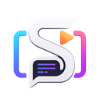
  <h1>SubPilot Studio</h1>
  <p><strong>AI-Powered Subtitle Editor & Video Encoder</strong></p>

  <p>
    <a href="https://github.com/nurfaizfy/subpilot-studio/graphs/contributors">
      
    </a>
    <a href="https://github.com/nurfaizfy/subpilot-studio/network/members">
      
    </a>
    <a href="https://github.com/nurfaizfy/subpilot-studio/stargazers">
      
    </a>
    <a href="https://github.com/nurfaizfy/subpilot-studio/issues">
      
    </a>
    <a href="https://github.com/nurfaizfy/subpilot-studio/blob/main/LICENSE">
      
    </a>
  </p>
</div>

---

## 🌟 About The Project

**SubPilot Studio** is a next-generation, cross-platform desktop application designed to supercharge the workflow of video creators, translators, and subtitle enthusiasts. By synergizing the privacy and speed of **Local AI (Whisper)** with the linguistic intelligence of **Cloud AI Providers (OpenAI, Gemini, Local LLMs)**, SubPilot Studio delivers an all-in-one ecosystem for generating, translating, editing, and rendering subtitles.

Unlike traditional subtitle tools that require bouncing between different software for transcription, translation, formatting, and encoding, SubPilot Studio provides a completely unified pipeline. You can manage multiple video projects within dedicated **Workspaces**, visually edit subtitles alongside a live **Video Preview and Audio Waveform**, and apply advanced **ASS/SSA Styling** with real-time feedback. 

For high-volume creators, the **Watch Folder Automation** allows you to put your workflow on autopilot—simply drop a video into a folder and let the app transcribe and translate it in the background. 

Whether you need to export clean `.srt`/`.ass` files independently, or use the **Hardware-Accelerated FFmpeg Integration** to bake stylistic hardsubs for social media or embed softsubs for MKV releases, SubPilot Studio provides a seamless, professional-grade experience right on your desktop. Built with Rust and Tauri, it ensures maximum performance while remaining incredibly lightweight.

---

## 📸 Screenshots

| | |
|:---:|:---:|
| 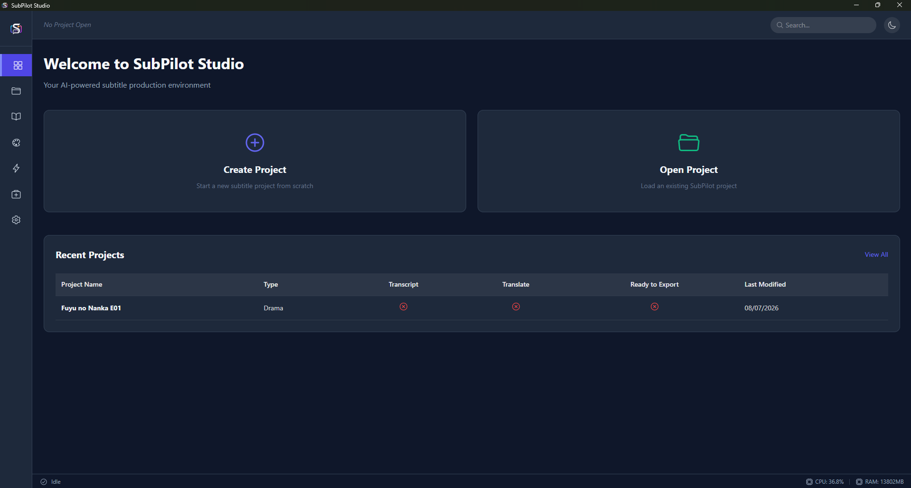 <br> **Dashboard** | 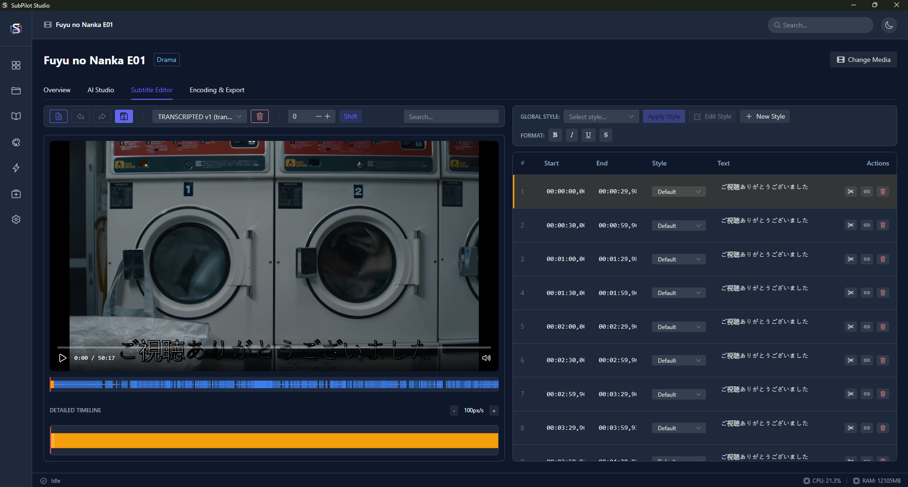 <br> **Subtitle Editor** |
| 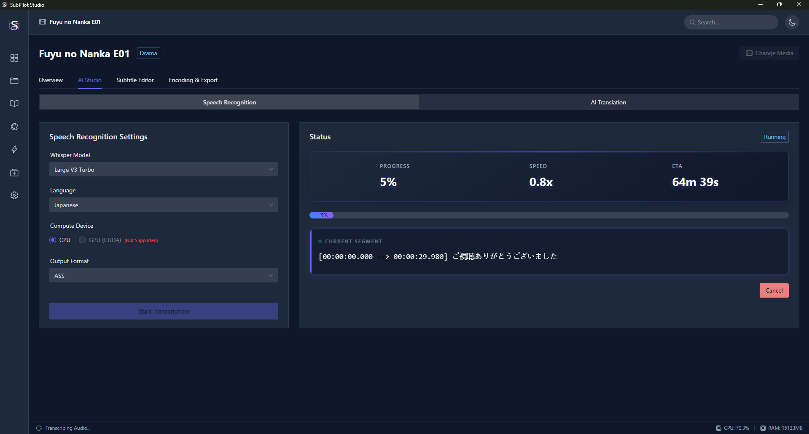 <br> **AI Transcription** | 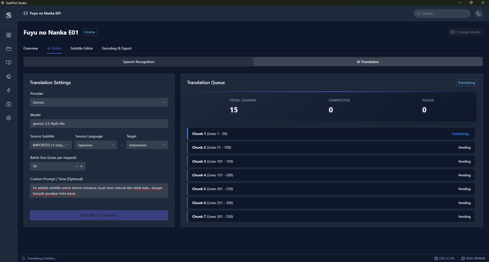 <br> **AI Translation** |
| 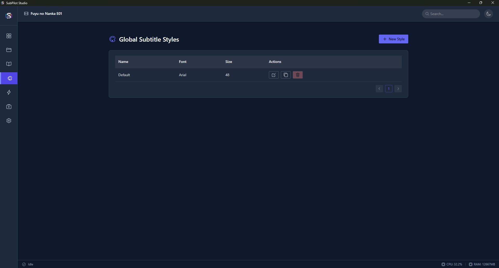 <br> **Subtitle Styling** | 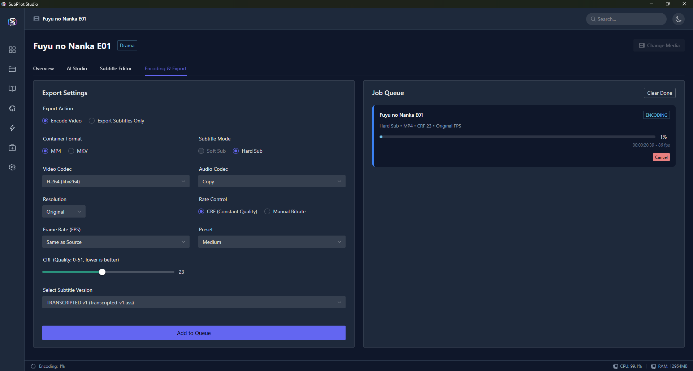 <br> **Video Encoding** |
| 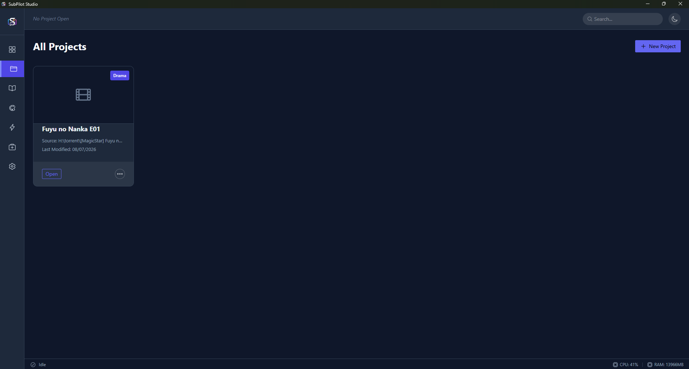 <br> **Projects List** | 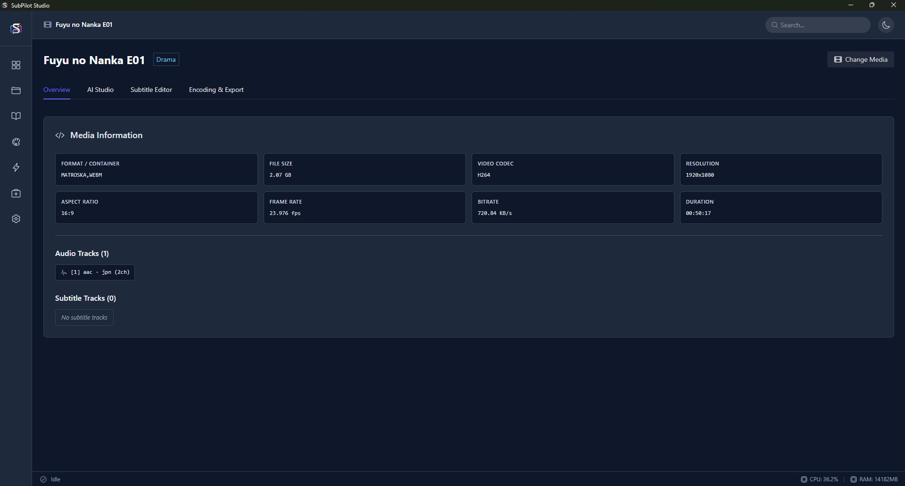 <br> **Project Overview** |
| 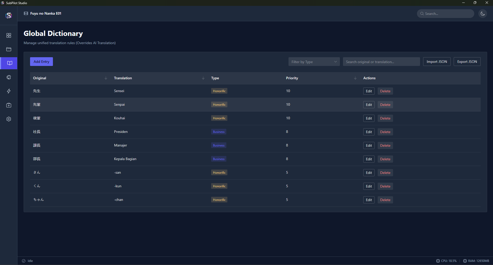 <br> **Dictionary** | 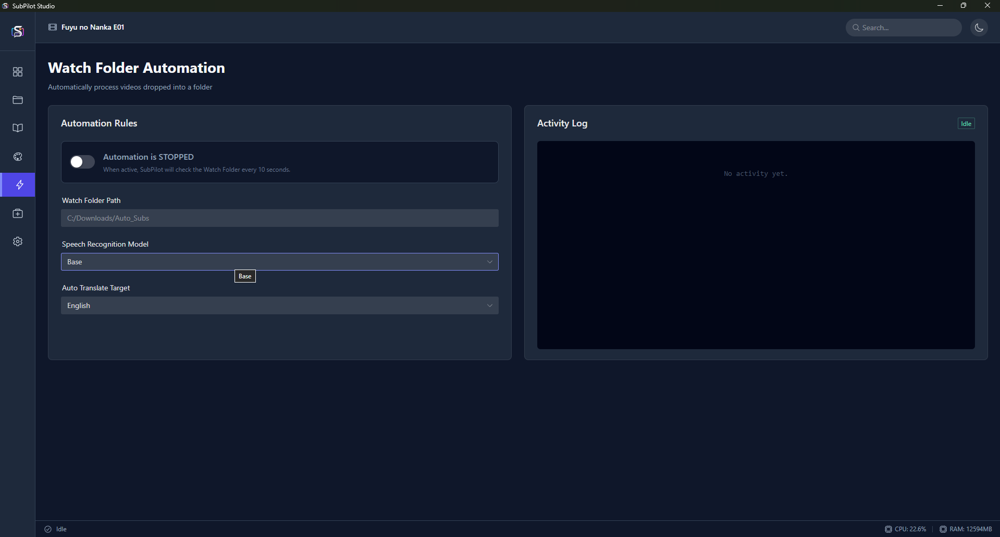 <br> **Automation** |
| 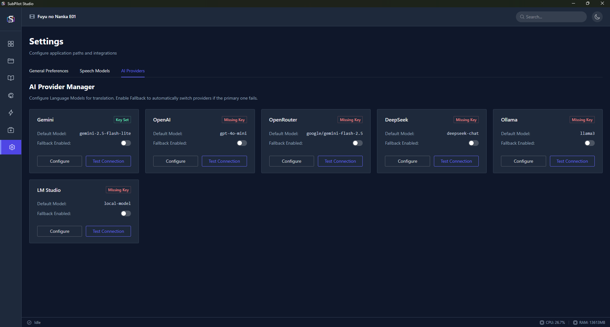 <br> **AI Providers** | 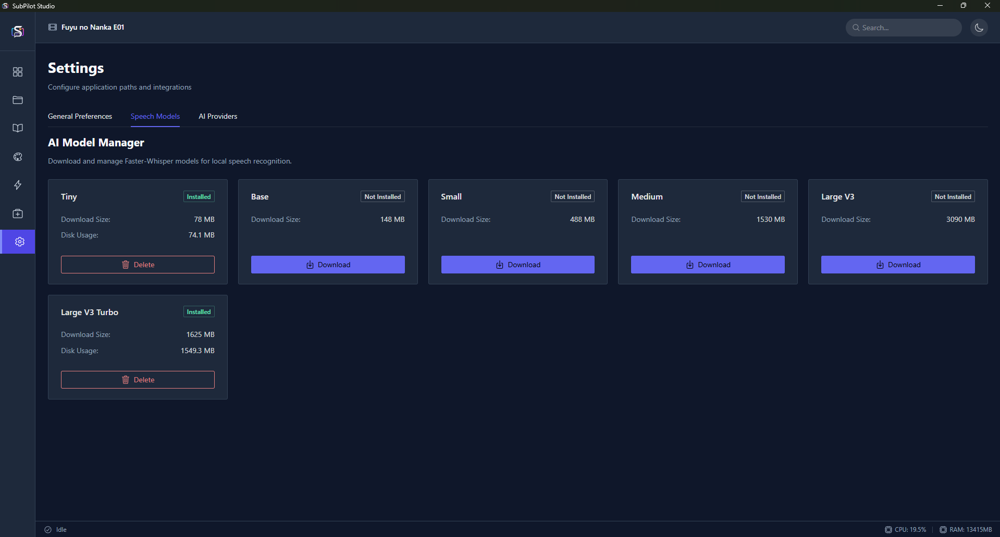 <br> **AI Models** |
| 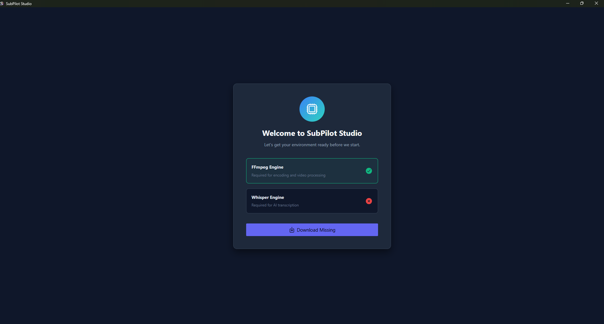 <br> **Initial Setup** | 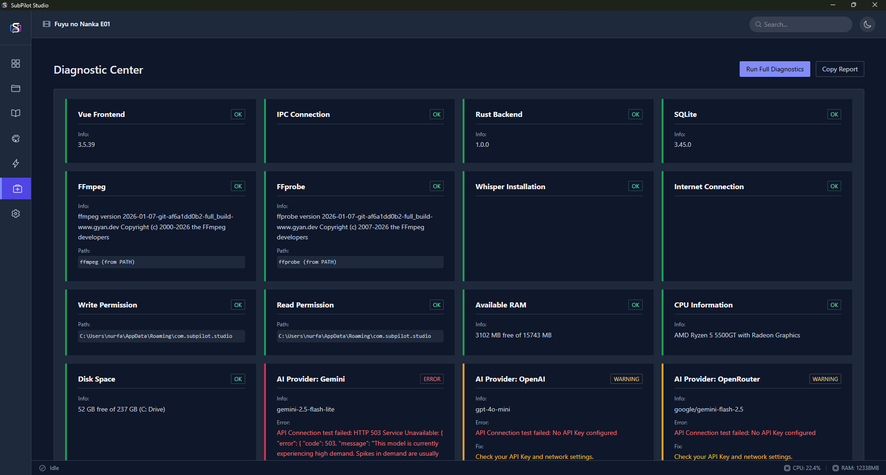 <br> **System Diagnostics** |

---

## ✨ Features

- 🤖 **AI Auto-Transcription**: Automatically generate subtitles from video/audio using Whisper (runs locally).
- 🌍 **Smart Translation**: Translate subtitles to any language using integrated AI Providers (OpenAI, Gemini, Local LLMs).
- ✏️ **Interactive Subtitle Editor**: A complete editor featuring a live video preview, audio waveform timeline, and virtual scrolling for handling massive subtitle files without lag.
- 🎨 **Advanced Subtitle Styling**: Full visual editor for ASS/SSA subtitle styling (fonts, colors, outlines, shadows, margins) with real-time on-screen preview.
- 🎬 **Video Encoding (Hardsub/Softsub)**: Built-in FFmpeg integration to bake subtitles directly into your videos (Hardsub) or embed them as tracks (Softsub).
- 🎛️ **Hardware Acceleration**: Support for NVENC (NVIDIA) and optimized CPU encoding (CRF, Custom Bitrate).
- 📁 **Project Workspace**: Organize your work efficiently. Manage multiple videos and their corresponding subtitle versions inside dedicated projects.
- 🤖 **Watch Folder Automation**: Set up a designated folder to automatically transcribe and translate any video dropped into it.
- 📤 **Standalone Subtitle Export**: Export clean `.srt` or `.ass` subtitle files instantly without needing to encode the video.
- 🧠 **AI Models Manager**: Download and manage your local Whisper AI models directly within the app.
- 📖 **Custom Dictionary**: Add custom terminology to ensure the AI translates specific names or jargon correctly.
- 🩺 **Diagnostic Center**: Built-in system check to ensure all dependencies (FFmpeg, Whisper, SQLite) are running perfectly.
- ⚡ **Lightning Fast & Lightweight**: Built with Rust and Tauri for maximum performance and minimal RAM usage.

---

## 🛠️ Built With

* [![Tauri][Tauri-badge]][Tauri-url]
* [![Vue][Vue.js]][Vue-url]
* [![TypeScript][TypeScript]][TypeScript-url]
* [![Rust][Rust]][Rust-url]
* [![FFmpeg][FFmpeg]][FFmpeg-url]
* **Pinia** (State Management)
* **Naive UI** (Component Library)
* **SQLite** (Local Database)

---

## 🚀 Getting Started

Follow these instructions to get a copy of the project up and running on your local machine for development and testing purposes.

### Prerequisites

You need to have the following installed on your system:
* [Node.js](https://nodejs.org/) (v18 or higher)
* [Rust](https://rustup.rs/) (v1.71 or higher)
* [FFmpeg](https://ffmpeg.org/download.html) (Ensure it's added to your system PATH)

### Installation & Build

1. Clone the repository
   ```sh
   git clone https://github.com/nurfaizfy/subpilot-studio.git
   ```
2. Navigate to the project directory
   ```sh
   cd subpilot-studio
   ```
3. Install NPM packages
   ```sh
   npm install
   ```
4. Run the app in development mode
   ```sh
   npm run tauri dev
   ```
5. Build the app for production (creates Windows Installer & Portable EXE)
   ```sh
   npm run tauri build
   ```
   *The compiled executables will be located in `src-tauri/target/release/bundle/`.*

---

## 💡 Usage

> [!IMPORTANT]
> **API Keys Required for Cloud Translation**
> While the Whisper transcription runs completely locally on your machine, the **Smart Translation** features rely on external Cloud AI providers. You must supply your own valid API Key (e.g., OpenAI, Gemini) in the **Providers** tab to use the translation capabilities.


1. **Setup Workspace**: Open the app and create a new project by importing a video file.
2. **AI Transcription**: Go to **AI Studio**, select your language, and click "Generate Subtitles" to let Whisper do the magic.
3. **Translation**: Configure your AI Provider in the **Providers** tab, then use the Translate feature to convert your subtitles.
4. **Styling**: Open the **Subtitle Styling** menu to customize how your subtitles will look on screen.
5. **Encoding**: Go to the **Encoding** tab, select your preferred format (MP4/MKV), choose "Hard Sub" or "Soft Sub", and click "Add to Queue".

---

## 🤝 Contributing

Contributions are what make the open source community such an amazing place to learn, inspire, and create. Any contributions you make are **greatly appreciated**.

1. Fork the Project
2. Create your Feature Branch (`git checkout -b feature/AmazingFeature`)
3. Commit your Changes (`git commit -m 'Add some AmazingFeature'`)
4. Push to the Branch (`git push origin feature/AmazingFeature`)
5. Open a Pull Request

---

## 📄 License

Distributed under the MIT License. See `LICENSE` for more information.

---

<div align="center">
  <b>Made with ❤️ by the SubPilot Team</b>
</div>

<!-- MARKDOWN LINKS & IMAGES -->
[Tauri-badge]: https://img.shields.io/badge/tauri-%2324C8DB.svg?style=for-the-badge&logo=tauri&logoColor=white
[Tauri-url]: https://tauri.app/
[Vue.js]: https://img.shields.io/badge/vuejs-%2335495e.svg?style=for-the-badge&logo=vuedotjs&logoColor=%234FC08D
[Vue-url]: https://vuejs.org/
[TypeScript]: https://img.shields.io/badge/typescript-%23007ACC.svg?style=for-the-badge&logo=typescript&logoColor=white
[TypeScript-url]: https://www.typescriptlang.org/
[Rust]: https://img.shields.io/badge/rust-%23000000.svg?style=for-the-badge&logo=rust&logoColor=white
[Rust-url]: https://www.rust-lang.org/
[FFmpeg]: https://img.shields.io/badge/FFmpeg-007808?style=for-the-badge&logo=FFmpeg&logoColor=white
[FFmpeg-url]: https://ffmpeg.org/
